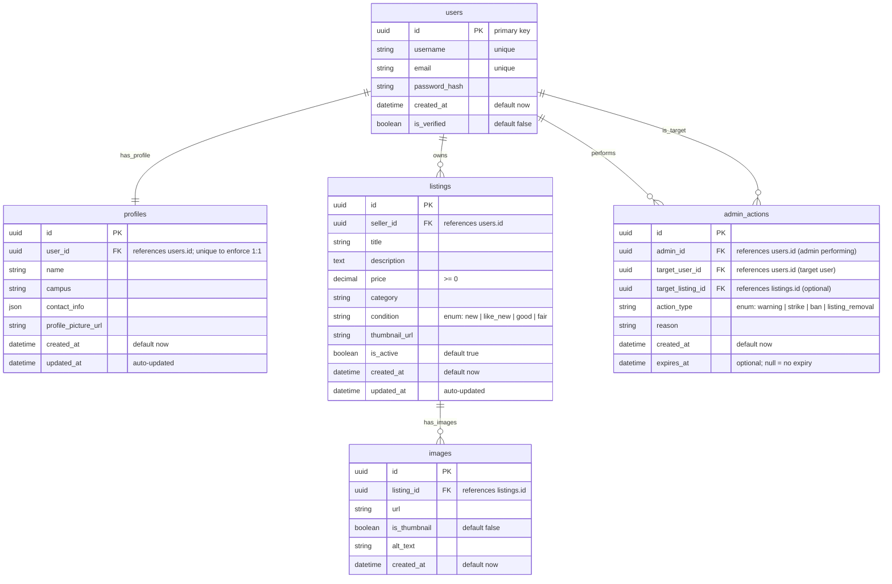

# Part 4: Database Schema

**Explanation**: This schema models a marketplace with users, profiles, listings, images, and moderation actions. users holds auth and account flags (unique username/email, is_verified) and has a 1:1 relationship with profiles for personal details. listings belong to a user (seller_id) and capture item metadata (price, category, condition enum), while images attach to listings to store media and optional thumbnail status. admin_actions records moderation events, linking the acting admin (admin_id) and the affected user (target_user_id), and—when relevant—the affected listing via target_listing_id; action_type is an enum (warning/strike/ban/listing_removal), with reason for context and optional expires_at for time-boxed actions. Timestamps (created_at, and updated_at where applicable) support auditing and change tracking.
