# Part 4: Database Schema

```mermaid
erDiagram
    users {
        uuid     id PK                    "primary key"
        string   username                 "unique, indexed"
        string   email                    "unique, indexed"
        string   hashed_password
        boolean  is_verified              "default false"
        string   role                     "enum: user | admin; default user, indexed"
        datetime created_at               "default now"
    }

    profiles {
        uuid     id PK
        uuid     user_id FK               "references users.id; unique, indexed (1:1)"
        string   name
        string   campus                   "nullable"
        json     contact_info             "nullable, dict with email/phone"
        string   profile_picture_url      "nullable"
        datetime created_at               "default now"
        datetime updated_at               "auto-updated"
    }

    listings {
        uuid     id PK
        uuid     seller_id FK             "references users.id, indexed"
        string   title
        text     description
        decimal  price                    "Numeric(10,2)"
        string   category                 "enum (22 values), indexed"
        string   condition                "enum: new | like_new | good | fair | poor"
        string   thumbnail_url            "nullable"
        boolean  is_active                "default true, indexed"
        datetime created_at               "default now"
        datetime updated_at               "auto-updated"
    }

    images {
        uuid     id PK
        uuid     listing_id FK            "references listings.id"
        string   url
        boolean  is_thumbnail             "default false"
        string   alt_text
        datetime created_at               "default now"
    }

    admin_actions {
        uuid     id PK
        uuid     admin_id FK              "references users.id, SET NULL on delete, indexed"
        uuid     target_user_id FK        "references users.id, SET NULL on delete, indexed"
        uuid     target_listing_id FK     "references listings.id, SET NULL on delete"
        string   action_type              "enum: strike | ban | listing_removal, indexed"
        string   reason                   "nullable, max 255 chars"
        datetime created_at               "default now"
        datetime expires_at               "nullable"
    }

    %% Relationships
    users     ||--|| profiles       : has_profile
    users     ||--o{ listings       : owns
    listings  ||--o{ images         : has_images
    users     ||--o{ admin_actions  : performs
    users     ||--o{ admin_actions  : is_target
```

**Explanation**: This schema models a marketplace with users, profiles, listings, images, and moderation actions.

- **users**: Holds authentication credentials (unique username/email, hashed_password) and account metadata. The `role` field (enum: user | admin) determines permissions, with `is_verified` tracking email confirmation. The `created_at` timestamp supports account history tracking. Users are indexed on username, email, and role for efficient lookups.

- **profiles**: One-to-one relationship with users via unique `user_id` foreign key. Stores personal details: `name` (required), `campus` (nullable), `contact_info` (nullable JSON dict with email/phone), and `profile_picture_url` (nullable). Timestamps (`created_at`, `updated_at`) track profile changes. CASCADE delete ensures profile is removed when user is deleted.

- **listings**: Marketplace items owned by users via `seller_id` foreign key. Contains `title`, `description` (text), `price` (Numeric 10,2), `category` (enum with 22 values like electronics, textbooks, furniture), and `condition` (enum: new | like_new | good | fair | poor). The `thumbnail_url` is nullable, `is_active` defaults to true for filtering active listings. Timestamps track creation and updates. Indexed on seller_id, category, and is_active for efficient queries. CASCADE delete removes listings when seller is deleted.

- **images**: (Planned) One-to-many with listings to store multiple image URLs per listing, with `is_thumbnail` flag and `alt_text` for accessibility.

- **admin_actions**: Audit trail for moderation events. Links the acting admin (`admin_id`), the affected user (`target_user_id`), and optionally the affected listing (`target_listing_id`). All foreign keys use SET NULL on delete to preserve audit history even if referenced entities are removed. The `action_type` enum (strike | ban | listing_removal) categorizes the action, with `reason` (max 255 chars, nullable) providing context. The `expires_at` timestamp (nullable) supports time-boxed actions like temporary bans. Indexed on admin_id, target_user_id, and action_type for audit queries.

**Key Design Decisions**:
- **Audit trail preservation**: AdminAction foreign keys use SET NULL instead of CASCADE to maintain historical records for compliance
- **Cascade deletes**: User deletions cascade to profiles and listings (personal data cleanup)
- **Indexing strategy**: Heavy indexing on foreign keys, enums, and boolean flags for query performance
- **Nullable fields**: Optional fields (campus, contact_info, profile_picture_url, thumbnail_url, reason, expires_at) are explicitly nullable
