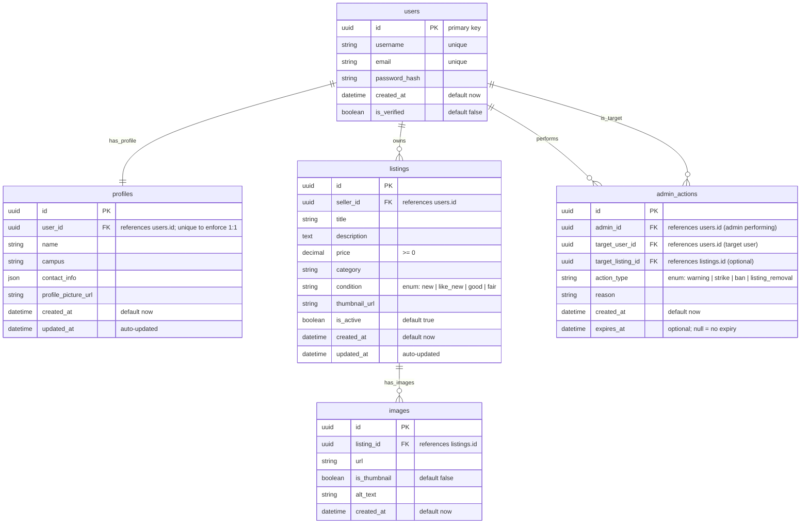

# Part 1: Overview

## Title

Aztec List

## Description

In essence, this is an offerup clone geared towards college students. It will allow students to post items they want to sell, and allow other students to purchase items they might need from others at prices lower than msrp. They will be able to post photos of their items with a description connected to a messaging system to organize the sell. 

## Main Features & Functionality

1. search items by filter
2. list set amount per search (cursor based pagination?)
3. create item listing
4. modify/remove item listing
5. message seller/buyer (on the fence => scope too large)
6. admin striking system & user banning

# Part 2: API Endpoints 

<mark>Endpoint URL</mark>: `/api/listings` <br>
HTTP Method : `GET` <br>
Description : `Retrieve a paginated list of active listings with optional filters for search and price/category` <br>

Request Parameters<br>
Query (all optional)
- `q` (string): Full-text search over title/description.
- `category` (string): Filter by category slug/name (e.g., "electronics").
- `min_price` (float ≥ 0): Minimum price filter.
- `max_price` (float ≥ 0): Maximum price filter.
- `condition` (enum: new, like_new, good, fair): Item condition filter.
- `seller_id` (UUID): Filter by a specific seller.
- `limit` (int, 1–100, default 20): Page size.
- `cursor` (string): Opaque cursor for next page (returned by previous call).
- `sort` (enum: recent, price_asc, price_desc; default recent): Sort order.

Response Structures <br>
**200 OK** 
```
{
  "items": [
    {
      "id": "uuid",
      "title": "string",
      "price": 49.99,
      "category": "electronics",
      "condition": "good",
      "thumbnail_url": "https://...",
      "created_at": "2025-10-01T12:34:56Z",
      "seller_id": "uuid"
    }
  ],
  "next_cursor": "string or null",
  "count": 20
}
```
**400 Bad Request**
```
{ "detail": "Invalid parameter: max_price must be >= min_price" }
```
**500 Internal Server Error**
```
{ "detail": "Unexpected server error" }
```
How this path works:
- The path `/api/listings` identifies the listings collection.
- Filters are passed as query params (e.g., `/api/listings?q=macbook&min_price=300`).
- Pagination uses `limit + cursor`. You get next_cursor from the response and pass it back to fetch the next page. Sorting is stable with the cursor.

---

<mark>Endpoint URL</mark>: `/api/listings/{listing_id}` <br>
HTTP METHOD: `GET` <br>
Description: `Retrieve details of a single listing by its unique ID`<br>

Request Parameters<br>
Path: `listing_id`: unique identifier of the listing to fetch

Response Structure <br>
**200 OK** 
```
{
  "id": "uuid",
  "title": "MacBook Pro 2020",
  "description": "Lightly used, great condition.",
  "price": 850.00,
  "category": "electronics",
  "condition": "like_new",
  "images": [
    "https://.../image1.jpg",
    "https://.../image2.jpg"
  ],
  "seller_id": "uuid",
  "created_at": "2025-10-01T12:34:56Z",
  "is_active": true
}
```
**404 Not Found**
```
{ "detail": "Listing not found" }
```

How the path works: (WILL MOST LIKELY CHANGE THE ID PORTION)

- The {listing_id} part is a path parameter that uniquely identifies which listing you want.
- Example request:
  `/api/listings/4b8f1e9e-1a2b-4c33-8b7a-0ef5dfb12345`
- FastAPI automatically validates that the listing_id is a valid UUID before calling your route handler.

---

<mark>Endpoint URL</mark>: `/api/listings`<br>
HTTP Method: `POST`<br>
Description: `Create a new item listing for sale`<br>

Request Parameters<br>
Body (application/json or multipart/from data if-including images)
```
{
  "title": "MacBook Pro 2020",
  "description": "Lightly used, excellent condition.",
  "price": 850.00,
  "category": "electronics",
  "condition": "like_new"
}
```
- `title` (string, required): Name of the item.
- `description` (string, required): Short description of the item.
- `price` (float ≥ 0, required): Listing price.
- `category` (string, required): Category (e.g., "electronics", "furniture").
- `condition` (enum: new, like_new, good, fair, required): Item condition.
- `images` (list of file uploads, optional): Uploaded item photos.
- Seller ID is inferred from the authenticated user.

Response Structure <br>
**201 Created (application/json)**
```
{
  "id": "uuid",
  "title": "MacBook Pro 2020",
  "price": 850.00,
  "category": "electronics",
  "condition": "like_new",
  "seller_id": "uuid",
  "created_at": "2025-10-04T12:34:56Z",
  "is_active": true
}
```
**400 Bad Request**
```
{ "detail": "Missing required field: title" }
```
**401 Unathorized**
```
{ "detail": "Authentication required" }
```
How the path works
- The `/api/listings` endpoint represents the collection of listings.
- `POST` creates a new resource within that collection.
- The request body contains listing data; FastAPI validates and saves it to the database, then returns the created listing.

---

<mark>Endpoint URL</mark>: `/api/listings/{listing_id}`<br>
HTTP Method: `PATCH` <br>
Description: `Update an existing listing's details (only allowed for the seller who created it)`<br>

Request Parameters<br>
Path `listing_id`: ID of the listing to update
Body
```
{
  "title": "MacBook Pro 2020 - Updated",
  "description": "Still in great condition, reduced price.",
  "price": 799.99,
  "category": "electronics",
  "condition": "good",
  "is_active": true
}
```
- All fields are optional; only provided fields will be updated
- `is_active` can be toggled to temporarily hid the listing
- `seller_id` is inferred from auth and cant be changed

Response Structure<br>
**200 OK**
```
{
  "id": "uuid",
  "title": "MacBook Pro 2020 - Updated",
  "price": 799.99,
  "category": "electronics",
  "condition": "good",
  "seller_id": "uuid",
  "is_active": true,
  "updated_at": "2025-10-04T14:22:00Z"
}
```
**400 Bad Request**
```
{ "detail": "Invalid price value" }
```
**401 Unauthorized**
```
{ "detail": "Authentication required" }
```
**403 Forbidden**
```
{ "detail": "You are not the owner of this listing" }
```

How the path works:

- `/api/listings/{listing_id}` targets a specific listing by ID.
- The PATCH method replaces or updates that listing’s stored data.
- FastAPI will merge only the provided fields (e.g., if you omit description, it stays    unchanged).
- Authorization logic ensures only the listing’s creator can modify it.

---

<mark>Endpoint URL</mark>: `/api/listings/{listing_id}`<br>
HTTP Method: `DELETE`<br>
Description: `Pemanently delete a listing (seller or admin)`<br>

Request Parameters<br>
Path `listing_id`: Listing to remove

Response Structure <br>
**204 No content**
```
Empty body deletion success
```
**401 Unauthorized**
```
{ "detail": "Authentication required" }
```
**403 Forbidden**
```
{ "detail": "You are not allowed to delete this listing" }
```
**404 Not found**
```
{ "detail": "Listing not found" }
```

How the path works:
- Targets a single resource via `{listing_id}` and removes it from storage.
- Returns 204 to signal success without payload (FastAPI best practice for deletes).
- Authorization ensures only the owner (or an admin) can perform the deletion.

---

<mark>Endpoint URL</mark>: `/api/users/{user_id}/listings`<br>
HTTP Method: `GET`<br>
Description: `Retrieve all active listings posted by a specific user`<br>

Request Parameters<br>
Path<br> 
`user_id`: ID of seller whos listings to retrieve
Query (optional)<br>
- `limit` (int, 1–100, default 20): Max listings per page.
- `cursor` (string): For pagination (returned from previous request).
- `sort` (enum: recent, price_asc, price_desc; default recent): Sorting option.
- `include_inactive` (bool, default false): Include sold/hidden listings if true.

Response Structure<br>
**200 OK**
```
{
  "items": [
    {
      "id": "uuid",
      "title": "Textbooks - CS Major",
      "price": 25.00,
      "category": "books",
      "condition": "good",
      "thumbnail_url": "https://.../cover.jpg",
      "created_at": "2025-10-02T14:00:00Z",
      "is_active": true
    }
  ],
  "next_cursor": "string or null",
  "count": 10
}
```
**404 Not Found**
```
{ "detail": "User not found" }
```
**500 Internal Server Error**
```
{ "detail": "Unexpected server error" }
```

How the path works:
- `/api/users/{user_id}/listings` is a nested route, representing all listings owned by one user.
- Query parameters support pagination and optional inclusion of inactive listings.
- This helps users view all their listings or lets others browse items from a single seller.

---

<mark>Endpoint URL</mark>: `/api/auth/signup`<br>
HTTP Method: `POST`<br>
Description: `Register a new user account for the app`<br>

Request Parameters<br>
Body
```
{
  "username": "alex123",
  "email": "alex@example.com",
  "password": "StrongPassword123"
}
```
- `username` (string, required, unique): Display name for the user.
- `email` (string, required, unique): Used for login and verification.
- `password` (string, required): Plaintext password (hashed before saving).

Response Structure<br>
**201 Created**
```
{
  "id": "uuid",
  "username": "alex123",
  "email": "alex@example.com",
  "created_at": "2025-10-04T15:00:00Z"
}
```
**400 Bad Request**
```
{ "detail": "Email already in use" }
```
**422 Unprocessable Identity**
```
{ "detail": "Password must be at least 8 characters" }
```

How the path works:
- `/api/auth/signup` creates a new user resource in the authentication system.
- The password is securely hashed using a library such as bcrypt or passlib.
- The response returns safe, non-sensitive user info — never the password or hash.
- Once registered, users can authenticate using `/api/auth/login`.

---

<mark>Endpoint URL</mark>: `/api/auth/login`<br>
HTTP Method: `POST`<br>
Description: `Authenticate a user and return a JWT access token for future authorized requests`<br>

Request Parameters<br>
Body
```
{
  "email": "alex@example.com",
  "password": "StrongPassword123"
}
```
- `email` (string, required): Registered email of the user.
- `password` (string, required): Plaintext password (validated against stored hash).

Response Structure<br>
**200 OK**
```
{
  "access_token": "jwt_token_string",
  "token_type": "bearer",
  "user": {
    "id": "uuid",
    "username": "alex123",
    "email": "alex@example.com"
  }
}
```
**401 Unathorized**
```
{ "detail": "Invalid email or password" }
```
**422 Unprocessable Identity**
```
{ "detail": "Email and password are required" }
```

How the path works:
- `/api/auth/login` handles user authentication using credentials from the request body.
- On success, FastAPI (via fastapi.security.OAuth2PasswordBearer) issues a JWT token.
- The client must include this token in the Authorization header for protected routes:
```
Authorization: Bearer <access_token>
```
---

<mark>Endpoint URL</mark>: `/api/users/{user_id}`<br>
HTTP Method: `GET`<br>
Description: Retirve a public profile of a specific user (seller info shown on their listings)<br>

Request Parameters<br>
Path `user_id`: Unique identifier of the user to fetch

Response Structure<br>
**200 OK**
```
{
  "id": "uuid",
  "username": "alex123",
  "email": "alex@example.com",
  "joined_at": "2025-10-01T12:34:56Z",
  "listings_count": 5,
  "is_verified": true
}
```
**404 Not Found**
```
{ "detail": "User not found" }
```

How the path works:
- The `{user_id}` is a path parameter that identifies which user’s data to return.
- This route exposes non-sensitive, public info only (e.g., username, stats).
- Useful for showing seller profiles when viewing their listings.

---

<mark>Endpoint URL</mark>: `/api/listings/{listigs_id}/images`<br>
HTTP Method: `POST`<br>
Description: `Upload one or more images for a listing; optionally set/override the thumbnail`<br>

Request Parameters<br>
Path
- `listing_id` (UUID, required): Listing to attach images to.

Body (multipart/form-data)
- `files` (List[File], required): 1–10 image files (jpg/png/webp).
- `set_as_thumbnail` (bool, optional, default false): If true, first uploaded image becomes the thumbnail.
- `alt_text` (List[string], optional): Alt text per image (same length as files).

Response Structure<br>
**201 Created**
```
{
  "listing_id": "uuid",
  "thumbnail_url": "https://cdn.example.com/i/tn_abc.webp",
  "images": [
    { "id": "uuid", "url": "https://cdn.example.com/i/abc.webp", "is_thumbnail": true },
    { "id": "uuid", "url": "https://cdn.example.com/i/def.webp", "is_thumbnail": false }
  ]
}
```
**400 Bad Request**
```
{ "detail": "At least one image is required" }
```
**403 Forbidden**
```
{ "detail": "You are not the owner of this listing" }
```

How the path works:
- Send images via multipart/form-data; server stores them (e.g., S3) and updates the listing’s image set, marking the thumbnail if requested or if none exists.

---

<mark>Endpoint URL</mark>: `/api/listings/{listing_id}/images/{image_id}`<br>
HTTP Method: `DELETE`<br>
Description: `Delete a specific image associated with a listing (only allowed for the listing owner or admin).`<br>

Request Parameters<br>
Path
- `listing_id` (UUID, required): The listing the image belongs to.
- `image_id` (UUID, required): The specific image to delete.

Response Structure
**204 No content**
```
Empty body (aka no images)
```
**404 Not found**
```
{ "detail": "Image not found or does not belong to this listing" }
```

How the path works:
- Targets a specific image within a listing using {listing_id} and {image_id}.
- On success, the image record and its stored file (e.g., S3 or local storage) are deleted.
- If the deleted image was the thumbnail, you can automatically set the first remaining image as the new thumbnail.

---

<mark>Endpoint URL</mark>: `/api/listings/{listing_id}/images/thumbnail` <br>
HTTP Method: `PATCH`<br>
Description: `Set or change the thumbnail image for a listing`<br>

Path
- listing_id (UUID, required): The listing whose thumbnail will be changed.
Body
```
{
  "image_id": "uuid"
}
```
- `image_id` (UUID, required): The ID of one of the listing’s existing images to set as the new thumbnail.

Response Structure:
**200 OK**
```
{
  "listing_id": "uuid",
  "thumbnail_url": "https://cdn.example.com/i/tn_abc.webp",
  "updated_at": "2025-10-05T18:30:00Z"
}
```
**400 Bad Request**
```
{ "detail": "Image does not belong to this listing" }
```
**403 Forbidden**
```
{ "detail": "You are not the owner of this listing" }
```
How the path works:
- `/api/listings/{listing_id}/images/thumbnail` targets the thumbnail setting for a specific listing.
- The request body passes the image_id of an existing uploaded image.
- FastAPI verifies ownership, updates the listing’s thumbnail_url, and optionally marks the previous thumbnail as regular.

---

<mark>Endpoint URL</mark>: `/api/users/profile` <br>
HTTP Method: `POST` <br>
Description: `Create a user profile for the authenticated user after signup` <br>

Request Parameters <br>
Body (application/json)
```
{
"name": "Alex Johnson",
"campus": "San Diego State University",
"contact_info": {
"email": "alex@example.com",
"phone": "555-123-4567"
}
}
```
- `name` (string, required): Full name of the user.
- `campus` (string, optional): University or campus name.
- `contact_info` (object, optional): Contains user contact methods such as email or phone.

Response Structure <br>
**201 Created**
```
{
"id": "uuid",
"user_id": "uuid",
"name": "Alex Johnson",
"campus": "San Diego State University",
"contact_info": {
"email": "alex@example.com",
"phone": "555-123-4567"
},
"profile_picture_url": null,
"created_at": "2025-10-05T15:00:00Z"
}
```
**400 Bad Request**
```
{ "detail": "Profile already exists for this user" }
```
**401 Unauthorized**
```
{ "detail": "Authentication required" }
```

---

<mark>Endpoint URL</mark>: `/api/users/profile` <br>
HTTP Method: `GET` <br>
Description: `Retrieve the authenticated user's full profile, including optional listings` <br>

Request Parameters <br>
Query (optional)
- `include_listings` (bool, default false): Include user's active listings in response.

Response Structure <br>
**200 OK**
```
{
"id": "uuid",
"user_id": "uuid",
"name": "Alex Johnson",
"campus": "San Diego State University",
"contact_info": {
"email": "alex@example.com",
"phone": "555-123-4567"
},
"profile_picture_url": "https://cdn.example.com/u/pic123.webp",
"listings": [
{
"id": "uuid",
"title": "Used iPad Air",
"price": 250.00,
"thumbnail_url": "https://cdn.example.com/i/ipad.webp"
}
]
}
```
**401 Unauthorized**
```
{ "detail": "Authentication required" }
```


---

<mark>Endpoint URL</mark>: `/api/users/profile` <br>
HTTP Method: `PATCH` <br>
Description: `Update fields of the authenticated user's profile` <br>

Request Parameters <br>
Body (application/json)
```
{
"name": "Alex J.",
"campus": "SDSU",
"contact_info": {
"phone": "555-999-8888"
}
}
```
- All fields optional; only provided ones are updated.

Response Structure <br>
**200 OK**
```
{
"id": "uuid",
"name": "Alex J.",
"campus": "SDSU",
"contact_info": {
"email": "alex@example.com",
"phone": "555-999-8888"
},
"updated_at": "2025-10-05T16:10:00Z"
}
```
**401 Unauthorized**
```
{ "detail": "Authentication required"}
```
**404 Not Found**
```
{ "detail": "Profile not found" }
```

---

<mark>Endpoint URL</mark>: `/api/users/profile/picture` <br>
HTTP Method: `POST` <br>
Description: `Upload or replace the user's profile picture` <br>

Request Parameters <br>
Body (multipart/form-data)
- `file` (File, required): Image file to upload (jpg/png/webp).

Response Structure <br>
**201 Created**
```
{
"user_id": "uuid",
"profile_picture_url": "https://cdn.example.com/u/pic123.webp",
"updated_at": "2025-10-05T17:00:00Z"
}
```
**400 Bad Request**
```
{ "detail": "Invalid file format" }
```
**401 Unauthorized**
```
{ "detail": "Authentication required" }
```
**415 Unsupported Media Type**
```
{ "detail": "Only jpg, png, or webp files allowed" }
```

---

<mark>Endpoint URL</mark>: `/api/admin/actions` <br>
HTTP Method: `POST` <br>
Description: `Create a moderation action (warning, strike, ban, or listing_removal)` <br>

Request Parameters <br>
Body (application/json)
```
{
  "target_user_id": "uuid",
  "action_type": "ban",
  "reason": "fraudulent activity",
  "expires_at": "2025-10-13T12:00:00Z",
  "target_listing_id": null
}
```
- `target_user_id` (UUID, required): User receiving the action.
- `action_type` (enum, required): One of `warning`, `strike`, `ban`, `listing_removal`.
- `reason` (string, optional): Brief explanation for audit log.
- `expires_at` (ISO 8601 datetime, optional): End time for a temporary **ban**. If omitted for a ban, it is permanent.
- `target_listing_id` (UUID, required if `action_type = listing_removal`): The affected listing.

Response Structure <br>
**201 Created**
```
{
  "id": "uuid",
  "admin_id": "uuid",
  "target_user_id": "uuid",
  "action_type": "ban",
  "reason": "fraudulent activity",
  "target_listing_id": null,
  "created_at": "2025-10-06T12:00:00Z",
  "expires_at": "2025-10-13T12:00:00Z"
}
```
**401 Unauthorized**
```
{ "detail": "Authentication required" }
```
**403 Forbidden**
```
{ "detail": "Admin only" }
```
**404 Not Found**
```
{ "detail": "Target user or listing not found" }
```

---

<mark>Endpoint URL</mark>: `/api/admin/actions` <br>
HTTP Method: `GET` <br>
Description: `List moderation actions (filterable, cursor‑paginated)` <br>

Request Parameters <br>
Query (all optional)
- `target_user_id` (UUID)
- `admin_id` (UUID)
- `action_type` (enum: warning, strike, ban, listing_removal)
- `target_listing_id` (UUID)
- `from` (ISO 8601 datetime)
- `to` (ISO 8601 datetime)
- `limit` (int, 1–100, default 20)
- `cursor` (string)

Response Structure <br>
**200 OK**
```
{
  "items": [
    {
      "id": "uuid",
      "admin_id": "uuid",
      "target_user_id": "uuid",
      "action_type": "listing_removal",
      "reason": "counterfeit goods",
      "target_listing_id": "uuid",
      "created_at": "2025-10-06T12:15:00Z",
      "expires_at": null
    }
  ],
  "next_cursor": "string or null",
  "count": 20
}
```
**401 Unauthorized**
```
{ "detail": "Authentication required" }
```
**403 Forbidden**
```
{ "detail": "Admin only" }
```

---

<mark>Endpoint URL</mark>: `/api/admin/actions/{action_id}` <br>
HTTP Method: `GET` <br>
Description: `Retrieve details of a single admin action` <br>

Request Parameters <br>
Path `action_id`: ID of the admin action to fetch

Response Structure <br>
**200 OK**
```
{
  "id": "uuid",
  "admin_id": "uuid",
  "target_user_id": "uuid",
  "action_type": "warning",
  "reason": "profile image violates policy",
  "target_listing_id": null,
  "created_at": "2025-10-06T12:30:00Z",
  "expires_at": null
}
```
**401 Unauthorized**
```
{ "detail": "Authentication required" }
```
**403 Forbidden**
```
{ "detail": "Admin only" }
```
**404 Not Found**
```
{ "detail": "Action not found" }
```

---

<mark>Endpoint URL</mark>: `/api/admin/actions/{action_id}` <br>
HTTP Method: `DELETE` <br>
Description: `Revoke an admin action (e.g., lift a ban or undo an accidental strike)` <br>

Request Parameters <br>
Path `action_id`: ID of the action to revoke

Response Structure <br>
**204 No Content**
```
Empty body (revocation successful)
```
**401 Unauthorized**
```
{ "detail": "Authentication required" }
```
**403 Forbidden**
```
{ "detail": "Admin only" }
```
**404 Not Found**
```
{ "detail": "Action not found" }
```

---

<mark>Endpoint URL</mark>: `/api/admin/users/{user_id}/warning` <br>
HTTP Method: `POST` <br>
Description: `Issue a warning to a user (convenience wrapper)` <br>

Request Parameters <br>
Path `user_id`: User to warn <br>
Body (application/json)
```
{ "reason": "inappropriate language in listing" }
```

Response Structure <br>
**201 Created**
```
{
  "id": "uuid",
  "admin_id": "uuid",
  "target_user_id": "uuid",
  "action_type": "warning",
  "reason": "inappropriate language in listing",
  "target_listing_id": null,
  "created_at": "2025-10-06T13:00:00Z",
  "expires_at": null
}
```
**401 Unauthorized**
```
{ "detail": "Authentication required" }
```
**403 Forbidden**
```
{ "detail": "Admin only" }
```
**404 Not Found**
```
{ "detail": "User not found" }
```

---

<mark>Endpoint URL</mark>: `/api/admin/users/{user_id}/strike` <br>
HTTP Method: `POST` <br>
Description: `Add a strike to a user (convenience wrapper)` <br>

Request Parameters <br>
Path `user_id`: User to strike <br>
Body (application/json)
```
{ "reason": "repeat policy violation" }
```

Response Structure <br>
**201 Created**
```
{
  "id": "uuid",
  "admin_id": "uuid",
  "target_user_id": "uuid",
  "action_type": "strike",
  "reason": "repeat policy violation",
  "target_listing_id": null,
  "created_at": "2025-10-06T13:05:00Z",
  "expires_at": null
}
```
**401 Unauthorized**
```
{ "detail": "Authentication required" }
```
**403 Forbidden**
```
{ "detail": "Admin only" }
```
**404 Not Found**
```
{ "detail": "User not found" }
```

---

<mark>Endpoint URL</mark>: `/api/admin/users/{user_id}/ban` <br>
HTTP Method: `POST` <br>
Description: `Ban a user (temporary via expires_at or permanent if omitted)` <br>

Request Parameters <br>
Path `user_id`: User to ban <br>
Body (application/json)
```
{
  "reason": "fraudulent activity",
  "expires_at": "2025-10-13T12:00:00Z"
}
```

Response Structure <br>
**201 Created**
```
{
  "id": "uuid",
  "admin_id": "uuid",
  "target_user_id": "uuid",
  "action_type": "ban",
  "reason": "fraudulent activity",
  "target_listing_id": null,
  "created_at": "2025-10-06T13:10:00Z",
  "expires_at": "2025-10-13T12:00:00Z"
}
```
**401 Unauthorized**
```
{ "detail": "Authentication required" }
```
**403 Forbidden**
```
{ "detail": "Admin only" }
```
**404 Not Found**
```
{ "detail": "User not found" }
```

---

<mark>Endpoint URL</mark>: `/api/admin/listings/{listing_id}/remove` <br>
HTTP Method: `POST` <br>
Description: `Remove a listing for policy reasons and log the action` <br>

Request Parameters <br>
Path `listing_id`: Listing to remove <br>
Body (application/json)
```
{ "reason": "counterfeit goods" }
```

Response Structure <br>
**200 OK**
```
{
  "listing_id": "uuid",
  "status": "removed",
  "admin_action": {
    "id": "uuid",
    "admin_id": "uuid",
    "target_user_id": "uuid",
    "action_type": "listing_removal",
    "reason": "counterfeit goods",
    "target_listing_id": "uuid",
    "created_at": "2025-10-06T13:20:00Z",
    "expires_at": null
  }
}
```
**401 Unauthorized**
```
{ "detail": "Authentication required" }
```
**403 Forbidden**
```
{ "detail": "Admin only" }
```
**404 Not Found**
```
{ "detail": "Listing not found" }
```

---

<mark>Endpoint URL</mark>: `/api/admin/listings/{listing_id}/restore` <br>
HTTP Method: `POST` <br>
Description: `Restore a previously removed listing (if deletions are soft)` <br>

Request Parameters <br>
Path `listing_id`: Listing to restore <br>
Body (application/json)
```
{ "reason": "mistaken removal" }
```

Response Structure <br>
**200 OK**
```
{
  "listing_id": "uuid",
  "status": "restored"
}
```
**401 Unauthorized**
```
{ "detail": "Authentication required" }
```
**403 Forbidden**
```
{ "detail": "Admin only" }
```
**404 Not Found**
```
{ "detail": "Listing not found or not restorable" }
```

# Part 3: Data Models

**User Model**<br>
**Attributes:**

* `id`: UUID, primary key, auto-generated
* `username`: str, required, unique — user’s display name used in listings and profile
* `email`: str, required, unique — used for authentication and contact
* `password_hash`: str, required — hashed version of the user’s password
* `created_at`: datetime, default to current timestamp
* `is_verified`: bool, default `False` — becomes true when user email is verified

**Relationships:**

* **one to many →** A user can have many **listings** (`/api/listings` endpoints).
* **one to one →** A user has one **profile** (`/api/users/profile` endpoints).

**Explanation:**
This model represents the base registered user in the system — it connects directly to authentication endpoints (`/api/auth/signup`, `/api/auth/login`) and serves as the owner for listings (`/api/listings`) and the associated profile data (`/api/users/profile`).

---

**Profile Model**<br>
**Attributes:**

* `id`: UUID, primary key, auto-generated
* `user_id`: UUID, foreign key referencing `User.id`, required
* `name`: str, required — full name of the user
* `campus`: str, optional — name of the user’s university or campus
* `contact_info`: dict, optional — contains keys like `"email"` and `"phone"`
* `profile_picture_url`: str, optional — URL of uploaded profile picture
* `created_at`: datetime, default to current timestamp
* `updated_at`: datetime, auto-updated on changes

**Relationships:**

* **one to one →** Each **profile** belongs to one **user** (linked through `user_id`).
* **one to many →** A **profile** can display multiple **listings** posted by the same user.

**Explanation:**
This model corresponds to the `/api/users/profile` endpoints (POST, GET, PATCH, and `/picture` upload). It stores extended personal information that’s separate from authentication data, allowing users to manage names, contact info, campus affiliation, and profile images.

---

**Listing Model**<br>
**Attributes:**

* `id`: UUID, primary key, auto-generated
* `seller_id`: UUID, foreign key referencing `User.id`, required
* `title`: str, required — short name of the item being listed
* `description`: str, required — detailed description of the item
* `price`: float, required — must be ≥ 0
* `category`: str, required — e.g., “electronics”, “books”, “furniture”
* `condition`: enum(`new`, `like_new`, `good`, `fair`), required — item condition
* `thumbnail_url`: str, optional — URL to the primary (thumbnail) image
* `is_active`: bool, default `True` — used to hide or deactivate sold listings
* `created_at`: datetime, default to current timestamp
* `updated_at`: datetime, auto-updated on edits

**Relationships:**

* **many to one →** Each **listing** belongs to one **user** (the seller).
* **one to many →** Each **listing** can have multiple **images**.

**Explanation:**
This model powers the `/api/listings` endpoints (GET, POST, PATCH, DELETE) and `/api/users/{user_id}/listings`. It represents an item listed for sale, linking directly to the user who created it and the related images for display.

---

**Image Model**<br>
**Attributes:**

* `id`: UUID, primary key, auto-generated
* `listing_id`: UUID, foreign key referencing `Listing.id`, required
* `url`: str, required — URL where the image file is stored (e.g., CDN or S3 path)
* `is_thumbnail`: bool, default `False` — marks if this image is the listing’s main thumbnail
* `alt_text`: str, optional — descriptive text for accessibility or SEO
* `created_at`: datetime, default to current timestamp

**Relationships:**

* **many to one →** Each **image** belongs to one **listing**.

**Explanation:**
This model supports the `/api/listings/{listing_id}/images` (POST, DELETE) and `/thumbnail` (PATCH) endpoints. It handles image uploads, deletions, and thumbnail assignments, linking media assets directly to their respective listings.

---

**AdminAction Model**<br>
**Attributes:**

* `id`: UUID, primary key, auto-generated
* `admin_id`: UUID, foreign key referencing `User.id`, required — the admin performing the action
* `target_user_id`: UUID, foreign key referencing `User.id`, required — the user being warned, struck, or banned
* `target_listing_id`: UUID, optional — required when action_type = "listing_removal" so you don’t have to infer from the owner
* `action_type`: enum(`warning`, `strike`, `ban`, `listing_removal`), required — defines what moderation action occurred
* `reason`: str, optional — short text explaining why the action was taken
* `created_at`: datetime, default to current timestamp
* `expires_at`: datetime, optional — supports temporary bans; a lift happens automatically when time passes

**Relationships:**

* **many to one →** Each **admin action** is performed by one **admin user**.
* **many to one →** Each **admin action** targets one **user** (the subject of the moderation).

**Explanation:**
Backing the admin moderation and audit log, this model is written by the admin endpoints `/api/admin/actions` and convenience routes for warnings, strikes, bans, and listing removals. Each record captures the acting admin, target user, reason, and timing; `expires_at` enables temporary bans and `target_listing_id` links listing removals to the affected listing.

# Part 4: Database Schema



**Explanation**: This schema models a marketplace with users, profiles, listings, images, and moderation actions. users holds auth and account flags (unique username/email, is_verified) and has a 1:1 relationship with profiles for personal details. listings belong to a user (seller_id) and capture item metadata (price, category, condition enum), while images attach to listings to store media and optional thumbnail status. admin_actions records moderation events, linking the acting admin (admin_id) and the affected user (target_user_id), and—when relevant—the affected listing via target_listing_id; action_type is an enum (warning/strike/ban/listing_removal), with reason for context and optional expires_at for time-boxed actions. Timestamps (created_at, and updated_at where applicable) support auditing and change tracking.

# Part 5: Additional Considerations

## 1) Authentication

**Method:** JSON Web Tokens (JWT) using OAuth2 password flow. `/api/auth/login` authenticates credentials and returns an `access_token` with `token_type: bearer`; clients include it as `Authorization: Bearer <token>` on protected routes. Tokens are short‑lived (e.g., 60 minutes) and signed with HS256.

**Claims:** `sub` (user_id), `username`, `role` (`user|admin`), and `is_verified`. The `users.is_verified` flag is populated post‑email verification and can be required for state‑changing actions (e.g., creating listings or uploading images).

**Authorization rules:** 
- Admin endpoints (`/api/admin/*`) require `role=admin`.
- On each request, middleware/dependencies check for active moderation against the caller: if an **AdminAction** of type `ban` exists and is unexpired (or permanent), effectful routes return **403** (`"Account banned"`). Time‑boxed bans rely on `expires_at`; listing moderation can also be enforced via `target_listing_id`.

**Password security:** Store `password_hash` only (bcrypt/passlib). Enforce minimum complexity at signup and lock out/slow down repeated failed logins (rate limiting described below).

---

## 2) Middleware

- **CORS:** Allow only approved front‑end origins; expose `Authorization`, support `GET, POST, PATCH, DELETE`, and enable preflight caching.  
- **Rate limiting:** Per‑IP and per‑user sliding window (e.g., 100 req/15 min), with stricter limits on `/api/auth/*` to deter brute force. 429 responses include `Retry-After`.  
- **Structured logging + request IDs:** Inject an `X-Request-ID` and log method, path, status, latency, and `user_id` (if authenticated).  
- **Security headers:** HSTS (HTTPS only), `X-Content-Type-Options: nosniff`, `Referrer-Policy: no-referrer`, `Permissions-Policy` (minimal), `X-Frame-Options: DENY`.  
- **Validation & normalization:** Pydantic models enforce constraints (e.g., `min_price ≤ max_price`, `price ≥ 0`, valid `condition` enum). Invalid inputs return uniform errors (see §3).  
- **File upload guardrails:** For listing images enforce count (1–10), type (`jpg/png/webp`), and size limits; reject non‑owners with **403**.  
- **Pagination guardrails:** Enforce `limit` bounds (1–100) and cursor format for endpoints using `limit + cursor`.  
- **Caching/compression:** Enable gzip; for cacheable `GET` responses (e.g., listings, listing detail, user listings) send `ETag/If-None-Match` or short `Cache-Control` hints to reduce bandwidth.  
- **DB/session management:** Per‑request DB session with rollback on exceptions; close session in a `finally` block.  
- **Admin policy checks:** Before mutating a listing or user, check for active `admin_actions` records that ban the actor or that removed the target listing.

---

## 3) Error Handling

**Shape:** Keep a consistent envelope and add a request correlation id when possible:
```json
{ "detail": "Human‑readable message", "request_id": "uuid-optional" }
```

**Status mapping (examples):**
- **400 Bad Request** – Parameter/domain validation (e.g., `max_price must be >= min_price`).  
- **401 Unauthorized** – Missing/invalid token or bad login.  
- **403 Forbidden** – Not resource owner, admin‑only route, or account banned.  
- **404 Not Found** – Listing/user/image/action not found.  
- **422 Unprocessable Entity** – Body/field validation errors at signup/login (note the draft typo “Unprocessable Identity”).  
- **429 Too Many Requests** – Rate‑limit exceeded (includes `Retry-After`).  
- **500 Internal Server Error** – Unexpected server errors; log stack trace internally and return a generic message.  

For soft‑removed listings (if implemented), optionally return **410 Gone** from read endpoints; otherwise, use **404**.

---

## 4) Testing

**Manual/Exploratory:** Maintain a Postman collection covering happy paths and edge cases for all endpoints: listing search and detail, CRUD with ownership rules, image upload/thumbnail, auth, and the full admin action set (warning/strike/ban/listing_removal). Include environments for local/dev URLs and an “Admin” auth token.

**Automated:** 
- **API tests (pytest + FastAPI TestClient):** 
  - Auth: signup → login → authorized call; ensure 401 on missing token and 403 on admin routes without `role=admin`.  
  - Listings: create/update/delete by owner; non‑owner forbidden; search filtering, sorting, and `limit + cursor` pagination semantics.  
  - Images: upload types/count enforcement; set/clear thumbnail; deleting an image preserves thumbnail invariants.  
  - Profiles: create/get/patch and picture upload flow.  
  - Admin actions: create/list/get/delete; verify that active bans block mutations and that `expires_at` lifts bans automatically.
- **Fixtures:** Ephemeral DB (e.g., Postgres in Docker) migrated to the schema in Part 4; S3/local storage stub for images.  
- **Coverage goals:** ≥90% on route handlers, validators, and policy checks.
- **Performance smoke:** Simple load test of `/api/listings` with realistic filters and pagination to catch N+1 queries and ensure indexes are effective.

**Release criteria:** All automated tests pass, Postman collection verified end‑to‑end, and no open critical defects in error handling or authorization.

---

### 5) E2E UI Testing (future)
**When to add:** once the web UI is stable enough to exercise login → listing CRUD → images → profile flows.

**Scope:** 
- **Smoke (PR):** login, create listing, set thumbnail, edit+view listing, logout (<2m).
- **Regression (nightly):** filters/sorting/pagination, profile updates, admin actions, access control.

**Data & Auth:** seed known users/items; use programmatic login (hit `/api/auth/login`) and store the JWT to localStorage to skip UI auth.

**CI:** run smoke on every PR, full suite nightly; record video on failure only; parallelize if tests grow.

**Tooling:** Cypress **or** Playwright (tool‑agnostic for now). Use stable `data-test` selectors in the UI.
